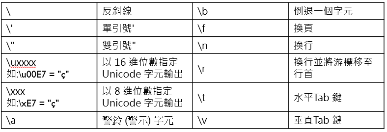

```{r panelset, echo=FALSE}
xaringanExtra::use_panelset()
```

```{cat, engine.opts = list(file = "color-text.lua")}
Span = function(el)
  color = el.attributes['color']
  -- if no color attribute, return unchange
  if color == nil then return el end
  
  -- transform to <span style="color: red;"></span>
  if FORMAT:match 'html' then
    -- remove color attributes
    el.attributes['color'] = nil
    -- use style attribute instead
    el.attributes['style'] = 'color: ' .. color .. ';'
    -- return full span element
    return el
  elseif FORMAT:match 'latex' then
    -- remove color attributes
    el.attributes['color'] = nil
    -- encapsulate in latex code
    table.insert(
      el.content, 1,
      pandoc.RawInline('latex', '\\textcolor{'..color..'}{')
    )
    table.insert(
      el.content,
      pandoc.RawInline('latex', '}')
    )
    -- returns only span content
    return el.content
  else
    -- for other format return unchanged
    return el
  end
end
```

## 什麼是變數

程式執行時，必須將所需的資料存在一個特別的地方，而這個地方被稱為「變數」

指定變數讓執行程式更有效率

## 宣告變數

java是一種嚴格型別(Strong-Typed)的程式語言，變數在使用前一定要宣告並指定類型

```{bash eval=FALSE, include=FALSE}
public class Java_in_9_13 {

	public static void main(String[] args) {
		int i;//宣告變數的「種類」
		i = 20;//用指定運算符設定變數的「內容」
		System.output.println(i);
	}

}
```

## 變數規則

### 駝峰寫法：

開頭英文小寫，之後英文大寫

ex:eBay、studentAge

### 每個變數的名稱都必須符合識別符號(Identifer)規範

1.  必須以英文字母開頭，大小寫不拘，也可以用"＿"或"\$"

2.  之後可以用0\~9

3.  長度不拘

4.  不能與保留字(Reserved Word)重複。

-   關鍵字：程式執行的動作

-   字面常數：java已設定的特定常數

5.  字母相同，大小寫不同的變數將被視為不同變數

## 資料型別(Data Types)

java中有許多不同的型別，如整數int，double型別d

其中又可分成兩種類別

-   基本型別(Primitive Data Types)：直接放在變數中，存放少量的資料

-   參照型別(Reference Data Types)：此型別資料放在額外配置的空間，變數裡的是地址， 經由參照變數的地址找到真正的資料， 通常用來存放大量資料

## 基本型別

分為兩大類，布林型別與數值型別

### 布林型別(Boolean Data Type)

包含true和false

```{java}
//布林型別範例
public class Java_in_9_13 {
 public static void main(String[] argv) {
 boolean test = false;
 System.out.println("布林變數答案是"+test);}
}
```

### 數值型別

又分為整數型別與浮點數型別

### 整數型別

分為五類

-   byte:-128\~127

-   short:-32678\~32767

-   int:-2147483648\~21748364

-   long:-9223372036854775808\~9223372036854775807

-   char:0\~65535

可以用10進位、2進位、16進位、8進位

-   10進位：非0開頭的整數

-   2進位：0b或0B開頭，只有0和1為合法數字

-   16進位：0x或0X開頭，可採用任意大寫寫英文字符組成

-   8進位：0開頭

```{java}
//正數型別
public class Java_in_9_13 {
 public static void main(String[] argv) {
 System.out.println("10進位的1113 ="+ 1357);
  
  //int型別2進位
 int i = 0b10011001;
 System.out.println("2進位的0b10011001 = "+i);
  
//long型別16進位
 long l = OXADEF;
 System.out.println("8進位的OXADEF = "+l);

//short型別8進位
short s = 01357;
System.out.println("8進位的01357 = "+s);}

//數字過長的情況下建議用底線區隔，使用long型別要在後面加上L
long l = 1_113_224_411L;
System.out.println("變數l ="+ l)}
  
}
```

char可以代表一個單一的Unicode字元

```{Java}
//char範例
public class Java_in_9_13 {
 public static void main(String[] argv) {
   
 char ch;
 ch='b';
 System.out.println("變數ch的內容 ="+ ch);
 
 ch='我';
 System.out.println("變數ch的內容 ="+ ch);
 
 ch=98;//為B的編碼
 System.out.println("變數ch的內容 ="+ ch);
 
 //跳脫序列編碼
 ch='\u5b57'//16進位5b57是'字'的編碼
 System.out.println("變數ch的內容 ="+ ch);
  }
  
}
```

### 浮點數型別(Floating Point Data Types)

分為float型別與double型別

注意：double和float建議在後面加上d和f

得用兩種方式代表

-   帶小數點：

-   科學記號：ex:1.32E2

```{java}

public class Java_in_9_13 {
 public static void main(String[] argv) {
   
 double d =1.32E2;
 System.out.println("變數double的內容 ="+ d);
 
 float f1 = 1.37123F;
 float f2 = 0.12345F;
 float f3 ;
 f3 = f1+f2;
 System.out.println(f3);
  }
  
}
```

## 參照型別

分為三種類別，分別是字串(String)、陣列（Array）、物件（Object)

### 字串(String)

String是一支"class"，所以他是大寫!

```{java}
//
public class Java_in_9_13 {
 public static void main(String[] argv) {
   
 String s1="第一個字串";
 String s2="第二個\t字串";//兩個字串中間可以使用跳脫序列;\t代表字元中的Tab
 
 System.out.println(s1);
 System.out.println(s2);
 System.out.println(s1+"\n"+s2);
 
  }
  
}
```

String也是一個object，因此他可以使用method，以下示範幾個

#### String Length

```{java}

public class Java_in_9_13 {
 public static void main(String[] argv) {
   
 String greeting ="Hello";
 
 System.out.printf("The lenth of greeting: %d",greeting.length());
 
  }
  
}
```

#### toUpperCase() and toLowerCase():

```{java}

public class Java_in_9_13 {
 public static void main(String[] argv) {
   
 String greeting ="Hello";
 
 System.out.println(greeting.toLowercase());
 System.out.println(greeting.toUppercase());
 
  }
  
}
```

#### indexOf()
某個字串在另外一個字串的第幾個位置

```{Java}
//
public class Java_in_9_13 {
 public static void main(String[] argv) {
   
 String txt ="Hello is word";
 String word = "Hello";
 
 System.out.println(txt.indexOf(word));
 
  }
  
}
```

#### String equals()

```{java}
//
public class Java_in_9_13 {
 public static void main(String[] argv) {
   
   String s1 ="Hello";
   String s2 ="Hello";
   String s3= "heiio";
   
 
   System.out.println(s1.equals(s2));
   System.out.println(s1.equals(s3));
 
  }
  
}
```

這裡要比較String equals()和==

簡單來說==比較兩個String有沒有相同"地址"

而equals()比較兩個String有沒有相同的內容

```{java,code_folding=TRUE}

public class Java_in_9_13 {
 public static void main(String[] argv) {
*  String s1 ="Hello";
   String s2 = new String("Hello");
   
   System.out.println(s1.equals(s2));
   System.out.println(s1 == s2);
 
 }
  
}
```
#### substring
在一個Sting當中，透過給定位置，賦予新的String該位置的內容

很抽象吧！

```{Java}

public class Java_in_9_13 {
 public static void main(String[] argv) {
  
    String A = "lsy";
		String b=A.substring(0,3);
		//代表從第0個(l)印到第3-1個(y)
		
		System.out.printf("%s",b);
 
 }
  
}
```


### 跳脫序列補充




