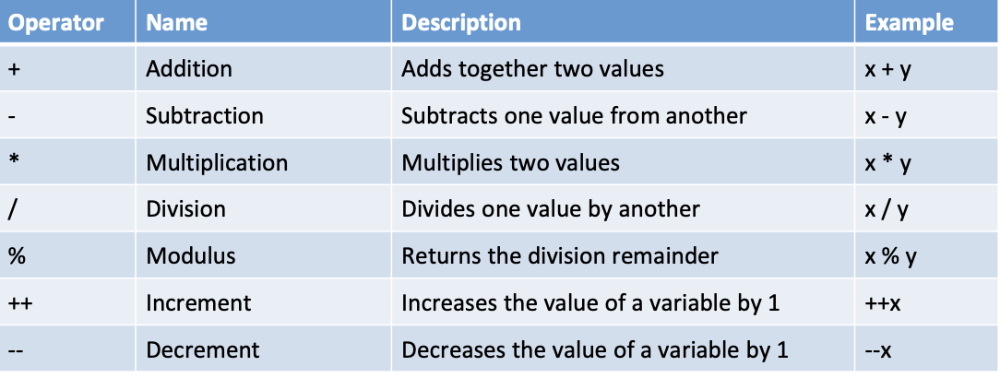
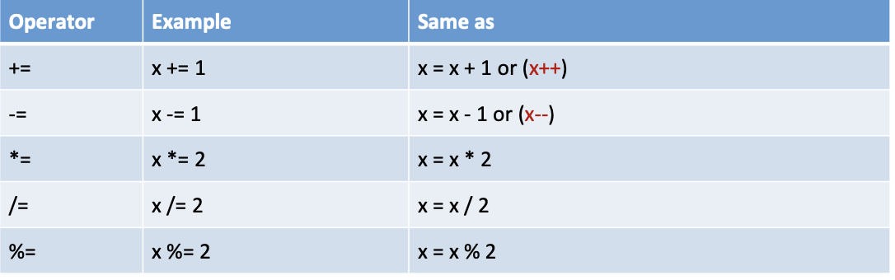
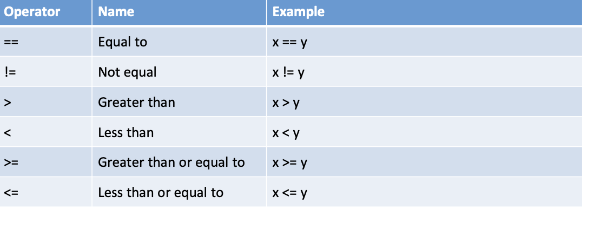

```{r panelset, echo=FALSE}
xaringanExtra::use_panelset()
```

```{cat, engine.opts = list(file = "color-text.lua")}
Span = function(el)
  color = el.attributes['color']
  -- if no color attribute, return unchange
  if color == nil then return el end
  
  -- transform to <span style="color: red;"></span>
  if FORMAT:match 'html' then
    -- remove color attributes
    el.attributes['color'] = nil
    -- use style attribute instead
    el.attributes['style'] = 'color: ' .. color .. ';'
    -- return full span element
    return el
  elseif FORMAT:match 'latex' then
    -- remove color attributes
    el.attributes['color'] = nil
    -- encapsulate in latex code
    table.insert(
      el.content, 1,
      pandoc.RawInline('latex', '\\textcolor{'..color..'}{')
    )
    table.insert(
      el.content,
      pandoc.RawInline('latex', '}')
    )
    -- returns only span content
    return el.content
  else
    -- for other format return unchanged
    return el
  end
end
```

## Java的Operater

分為四種類型

-   Arithmetic Operators:基礎的數學運算 

### %魔術運算的使用時機

1.用來檢測餘數是否為0

2.做週期運算

**除不了的數字的餘數就是原本的數字**

ex:7 % 2 = 2

3.控制範圍

假設我要把結果控制在3~15，因此總共有13種變化

運算：int num2 = (num1 % 13) +3

4.位置參照

-   Assignment Operators:即=，指派變數的值 

-   Logical Operators:包括and，or，not 

###長程與短程

&&和||為短程，&&左值不成立，右值不運算，||左值成立，右值不運算


```{Java}
//搭配boolean的運算

public class Java_in_9_13 {
 public static void main(String[] argv) {
   
   int a = 1, b =2, c = 3;
   
   boolean d = a >= b && b++ == c
   
   System.out.println(a);
   System.out.println(b);
   System.out.println(c);
   System.out.println(d);
 
 }
  
}
```

答案是：1 2 3 false

這對寫程式很有幫助

1.利用左值保護右值的概念替換if

2.減少多餘的運算

-   Comparison Operators:比較兩個變數 {.absolute top="100" left="75" width="900" height="\"600"}

值得注意的是，要盡量避免浮點數(double)的比較

## Type Casting

讓變數在基本型別中進行轉換，分為兩種

-   Widening Casting放大型別(automatically)

byte -\> short -\> char -\> int -\> long -\> float -\> double

-   Narrowing Casting限縮型別

byte \<- short \<- char \<- int \<- long \<- float \<- double

```{java}

public class Java_in_9_13 {
 public static void main(String[] argv) {
   
   int i1 = 33;
   int i4 = 12;
   double i2 = i1 ;//放大型別不需特別宣告
   int i3 = (int) i2 ;//縮小型別特別宣告
   double i5 = (double)(i1+14)/12; //在計算的時候記得要特別宣告
   
   System.out.println(i1);
   System.out.println(i2);
   System.out.println(i3);
   System.out.println(i5);
 
 }
  
}
```


## Math methods

-   Math.min，max找最小，最大值

-   Math.sqrt()找平方根後的值

-   Math.abs()找絕對值

-   Math.random()找出在0\~1之間的隨機值

## 用scanner取得使用者輸入

```{java}
import java.util.Scanner;
import java.util.Random;

public class Lab2 {

	public static void main(String[] args) {
		
	  int num1, num2;
	  
		Scanner sc = new Scanner(System.in);//打開scanner
		
		num1 = sc.nextInt();//由輸入端輸入一個整數
		num2 = sc.nextInt();//next()取字串，nextByte()取Byte值...
		
		System.out.print("gap = "+ num1-num2);
		
		sc.close();
		
	}

}
```


## 關於運算的小tip

### 運算和print分開做
