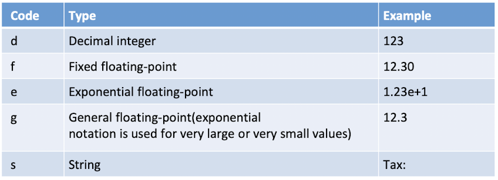
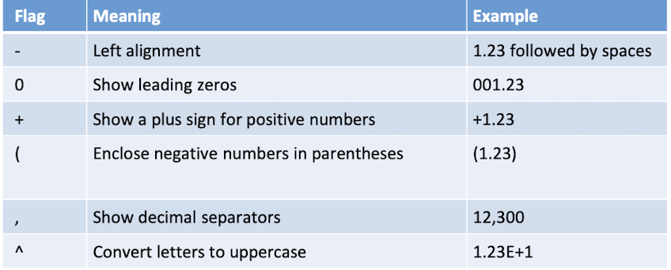
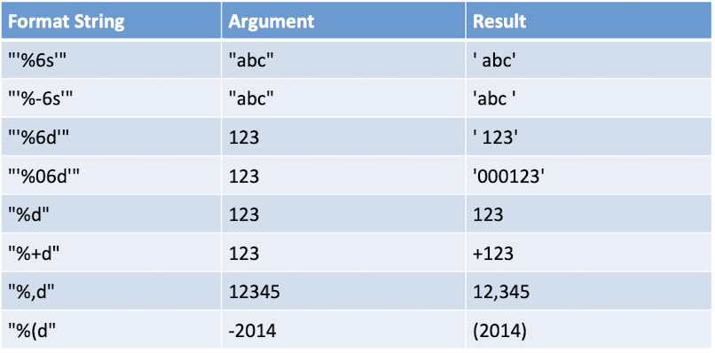
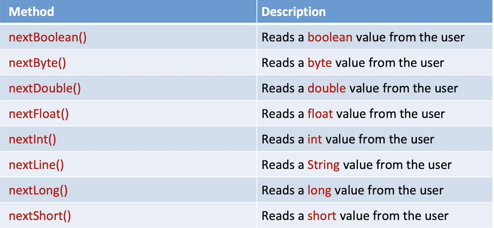

```{r panelset, echo=FALSE}
xaringanExtra::use_panelset()
```

```{cat, engine.opts = list(file = "color-text.lua")}
Span = function(el)
  color = el.attributes['color']
  -- if no color attribute, return unchange
  if color == nil then return el end
  
  -- transform to <span style="color: red;"></span>
  if FORMAT:match 'html' then
    -- remove color attributes
    el.attributes['color'] = nil
    -- use style attribute instead
    el.attributes['style'] = 'color: ' .. color .. ';'
    -- return full span element
    return el
  elseif FORMAT:match 'latex' then
    -- remove color attributes
    el.attributes['color'] = nil
    -- encapsulate in latex code
    table.insert(
      el.content, 1,
      pandoc.RawInline('latex', '\\textcolor{'..color..'}{')
    )
    table.insert(
      el.content,
      pandoc.RawInline('latex', '}')
    )
    -- returns only span content
    return el.content
  else
    -- for other format return unchanged
    return el
  end
end
```

## print, printf, println

想到這個就覺得有點煩

但其實他們的功能滿鮮明的

下圖說明

### print

最基礎的print，特性如下：

- 不會自動換行，透過\\n換行

- 用＋連接


### prinln

特別好的換行方法，特性如下：

- 用＋連接

### printf

當你需要print複雜一點點的東西時，請呼叫它

- 不會自動換行，透過\\n換行

- 只有一個""

- 搭配以下格式輸出



- 改變輸出的樣式



- 這個圖表幫助你比較幾個不同的樣式
 
 
 
::: panelset
:::panel
## 範例{.panel-name}
```{java}
public static void printf() {
		Scanner sc = new Scanner(System.in);
		int inum = 1113;
		String s = "我是字串";
		double dnum = 1113.1028d;
		System.out.printf("printf加\\n才會自動換行\n");
		System.out.printf("%d%s%f\n",inum,s,dnum);
		System.out.printf("%.2f\n",dnum);//控制小數點位數
		System.out.printf("%+f\n",dnum);//顯示＋號
		System.out.printf("%,f\n",dnum);//三個數字一個逗點
		System.out.printf("%07d\n",inum);往前占7格，並補上0
		System.out.printf("%-5d%s\n",inum,s);往後占5格
	}
```
:::
:::panel
## 結果{.panel-name}
printf加\\n才會自動換行

1113我是字串1113.102800

1113.10

+1113.102800

1,113.102800

0001113

1113 我是字串
:::
:::

## Scanner

交作業，檢查程式碼等等都會用到的東西

也算挺方便的東西，不過有些眉角要注意

### 前置作業

匯入API： `import java.util.Scanner;`

宣告：`Scanner sc = new Scanner(System.in);`

關閉：`sc.close`


### 輸入的型別


### 檢查輸入的型別

檢查：`sc.hasNextInt()`

丟棄輸入：`sc.next()`

### 示範

::: panelset
:::panel
## 範例{.panel-name}
```{java}
import java.util.Scanner;

public class sc {

		Scanner sc = new Scanner(System.in);
		System.out.printf("Please enter grades:");
		while (!sc.hasNextInt()) { //檢查是否為整數
			sc.next();//丟棄不對的
			System.out.println("拜託告訴我");
		}
		int grade = sc.nextInt();
		System.out.println("your grade is " + grade);
		
	}
  }
```
:::
:::panel
## 結果{.panel-name}
Please enter grades:不告訴你

拜託告訴我

No

拜託告訴我

100

your grade is 100

:::
:::

