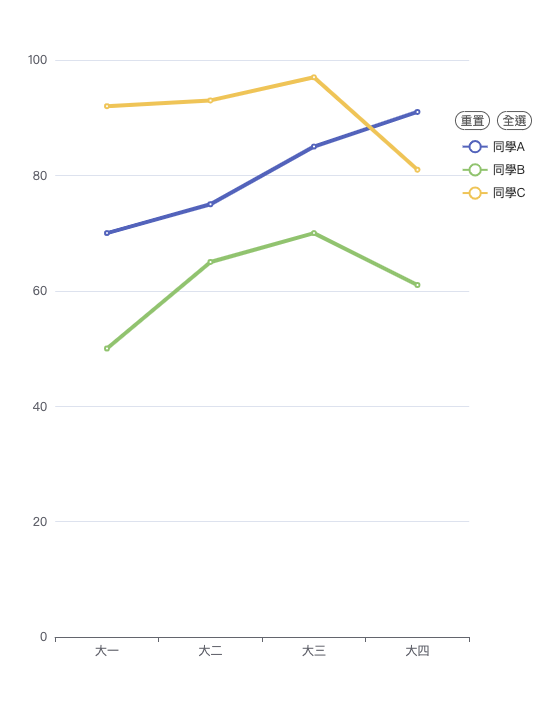

```{r echo=FALSE, fig.width=15, message=FALSE, warning=FALSE, preview=TRUE}

```

# 如何使用這個程式 {style="color:#004AAD;"}

### 第一步：上傳你的csv檔，並檢查你的檔案

### 第二步：選擇你的圖表樣式

### 第三步：調整你要輸出的表格大小

### 第四步：下載你的圖表

# 這個程式的code {style="color:#004AAD;"}

## <https://bookdown.org/yihui/rmarkdown/compile.html>

# 這是一個示範性的csv table {style="color:#004AAD;"}

```{r echo=FALSE, message=FALSE}
library(DT)
library(rmarkdown)
library(readr)
表1 <- read_csv("表1.csv")
paged_table(表1)
```

------------------------------------------------------------------------

# **這是一個動態圖表** {style="color:#004AAD;"}

```{r attr.source="style='display:inline-block;'", collapse=TRUE}
1:10  # a sequence from 1 to 10
10:1  # in the reverse order
```

# Two columns

::: {style="display: flex;"}
::: {style="flex: 7;"}
```{r attr.source="style='display:inline-block;'", collapse=TRUE}
1:10  # a sequence from 1 to 10
10:1  # in the reverse order
```
:::

::: {style="flex: 3;"}
```{r code_folding=TRUE,fig.height=20}
library(echarts4r)
library(tidyverse)
library(readr)
表1 <- read_csv("表1.csv")
表3 <- 表1 %>% gather(同學A, 同學B, 同學C, key = 學生, value = 分數)

plot1 <- 表3 %>% 
  group_by(學生) %>% 
  e_charts(x = 學期) %>% 
  e_line(分數, lineStyle = list(width = 4)) %>% 
  e_tooltip() %>% 
  e_animation("axis")

plot2<-plot1 %>% 
  e_grid(right = "15%") %>% 
  e_legend(orient = "vertical", right = "15", top = "15%", selector = list(list(type = "inverse", title = "重置"), list(type = "all", title = "全選")), width = 150)
plot2
```
:::
:::
